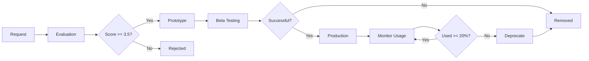

# Feature Request Management

## Overview
This document tracks and manages feature requests for the AI Engagement Hub, ensuring systematic development that aligns with our educational mission while preventing feature creep.

## Feature Evaluation Matrix

Each feature request is scored on these criteria (1-5 scale):

| Criterion | Weight | Description |
|-----------|--------|-------------|
| **Mission Alignment** | 40% | Supports human capacity growth (creativity, empathy, judgment, collaboration, discernment, adaptability) |
| **User Impact** | 25% | Number of users affected × frequency of use |
| **Technical Simplicity** | 20% | Ease of implementation and maintenance |
| **Integration** | 15% | Works seamlessly with existing features |

**Minimum Score for Approval: 3.5/5.0**

## Feature Categories

### 🎯 Core Features
Essential to the platform's mission. Cannot be removed.
- AI chat interface with educational prompting
- Course management system
- Student progress tracking
- Instructor oversight dashboard
- Project management
- Security and authentication

### ⚡ Enhancement Features
Improve existing workflows and user experience.
- Analytics improvements
- UI/UX refinements
- Performance optimizations
- Workflow streamlining

### 🧪 Experimental Features
Test new ideas with limited rollout.
- New AI model integrations
- Novel pedagogical tools
- Beta features for testing
- **Maximum: 3 active experiments**
- **Auto-sunset: After 3 months if adoption < 20%**

### 🎨 Nice-to-Have Features
Low priority improvements.
- Cosmetic changes
- Edge case handling
- Minor conveniences

## Feature Lifecycle



### Stages

1. **Request** - Documented with template, problem statement, and user story
2. **Evaluation** - Scored against matrix, priority assigned
3. **Prototype** - Time-boxed development (max 8 hours)
4. **Beta** - Limited rollout to 1-5 courses
5. **Production** - Full integration if metrics met
6. **Sunset** - Graceful deprecation and removal

## Current Feature Requests

### 🚀 Approved & In Development

| Feature | Category | Score | Status | Developer | ETA |
|---------|----------|-------|--------|-----------|-----|
| Email notifications | Enhancement | 4.2 | Beta | - | Jan 2025 |

### 📋 Under Evaluation

| Feature | Requestor | Date | Score | Decision |
|---------|-----------|------|-------|----------|
| _Example: AI Writing Coach_ | _Instructor A_ | _2025-01-16_ | _TBD_ | _Pending_ |

### ✅ Completed (Last 30 Days)

| Feature | Category | Launch Date | Adoption Rate |
|---------|----------|-------------|---------------|
| SendGrid Email API | Core | 2025-01-16 | N/A |
| Secure API Proxies | Core | 2025-01-16 | 100% |

### ❌ Rejected

| Feature | Reason | Date |
|---------|--------|------|
| _Example: Social Feed_ | _Out of scope - doesn't align with educational mission_ | _2025-01-01_ |

## Success Metrics

### Feature Health Indicators
- **Adoption Rate**: % of active users using feature within 30 days
- **Engagement**: Average uses per user per week
- **Support Burden**: Support tickets related to feature
- **Performance Impact**: Effect on page load and response times
- **Code Complexity**: Lines of code, dependencies, maintenance hours

### Thresholds
- **Keep**: Adoption > 20% OR critical for < 20% power users
- **Improve**: Adoption 10-20%, high support burden
- **Remove**: Adoption < 10% after 3 months
- **Emergency Remove**: Security risk OR performance degradation > 50%

## Feature Budget Rules

1. **Maximum Active Features**
   - Core: Unlimited (by definition)
   - Enhancement: 10 active
   - Experimental: 3 active
   - Nice-to-have: 5 active

2. **One In, One Out Policy**
   - For every new experimental feature, review existing ones
   - Consolidate overlapping features
   - Remove least-used features quarterly

3. **Time Boxing**
   - Prototype: 8 hours maximum
   - Beta development: 40 hours maximum
   - If exceeding budget, re-evaluate necessity

## Monthly Review Process

**First Monday of Each Month:**
1. Review usage analytics for all experimental features
2. Graduate successful experiments to production
3. Remove failed experiments
4. Evaluate new feature requests
5. Update this document

## How to Request a Feature

1. Create GitHub issue using [feature request template](.github/ISSUE_TEMPLATE/feature_request.md)
2. Include:
   - Clear problem statement
   - Affected user groups
   - Proposed solution
   - Success metrics
3. Tag with `feature-request` label
4. Instructor/admin requests get `priority-review` label

## Feature Flag Configuration

Features can be toggled via environment variables:
```env
# Feature Flags
REACT_APP_FEATURE_EMAIL_NOTIFICATIONS=true
REACT_APP_FEATURE_ADVANCED_ANALYTICS=false
REACT_APP_FEATURE_BETA_AI_MODELS=false
```

Or via `src/config/featureFlags.js` for dynamic control.

## Contact

- **Feature Request Reviews**: Monthly on first Monday
- **Emergency Features**: Contact admin team
- **Questions**: Post in GitHub Discussions

---

*Last Updated: January 2025*
*Next Review: February 2025*